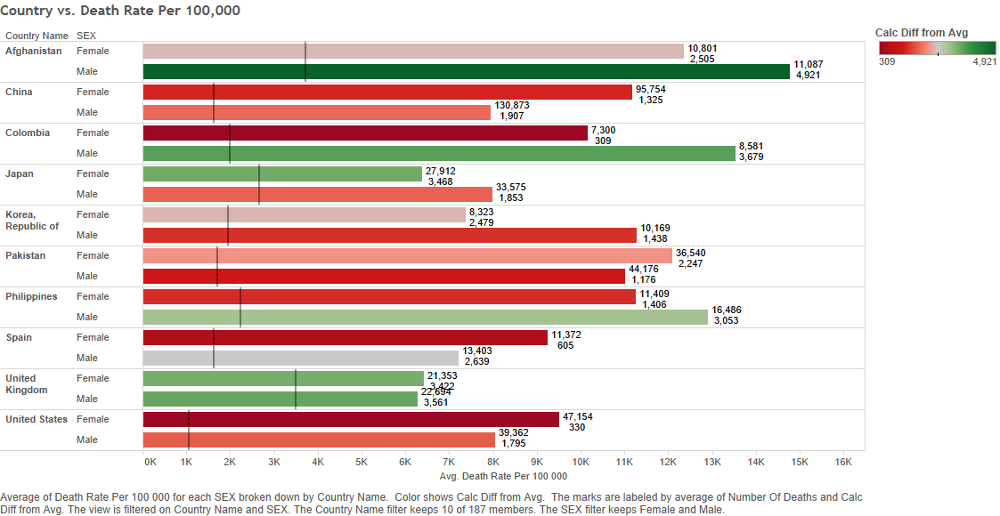

#### Steps used to create this project
#####1. Using GitHub, create a Repo
#####2. Clone the Repository into the Data Visualization Folder (Or the folder you wish)
#####3. Create R Studio Folders for all the project development (folder descriptions below)
#####4. Find a CSV that permits the creation of crosstabs, bar charts, and scatter plots
#####5. Modify the R_ETL.R given and run the code to get the code to develop a SQL table
#####6. Using Oracle SQL Developer, paste the code output from the R_ETL.R script to create a table
#####7. After the table is created, import the data from the CSV reformattted file to the table
#####9. Using Tableau, create the three required visualization plots
#####10. For bar charts, add the calculated difference from average and add a reference line for it. For the crosstab, calculate the KPI and color the table based on the cell's KPI value
#####11. Export Tableau plots as png files into the repo for presenting
#####12. Embed the pictures into the R Markdown file and press Knit HTML

#### Folders Needed
#####00 Doc: Holds the .Rmd and .html files containing these instructions and project output. Also holds RPROFILE to load all required packages and has the png files.
#####01 Data: Generates the code to create the table in Oracle. Gathers the data from the database for and puts it into data frames.
#####02 Tableau: Contains the .twbx file that has the tableau workbook
#####03 R SQL Visualizations: Contains the .R files that use ggplot to generate our graphs

#### Data Description
##### Our data looks at the way disease affects different countries accross the world. The two main variables are the number of deaths due to disease and the death rate per 100,000. The latter is a standard way of normalizing the number of deaths to be able to accurately compare and scale the effect disease has on each country despite size differences. This data is an accumulation of data from 1975-2010.

#### R markdown code
#####Immediately below is the code that embeds the pictures into the HTML
#####Since this project is only for Tableau, the third folder was not used.

### Visualizations

###   Bar Chart: 
####Shows how the death rate affects the sexes in several countries

###   Crosstab: 
####Shows how countries deaths rates are relative to each other using KPI

###   Scatter Plot: 
####Shows how number of deaths correlates to the death rate for sex and age groups

